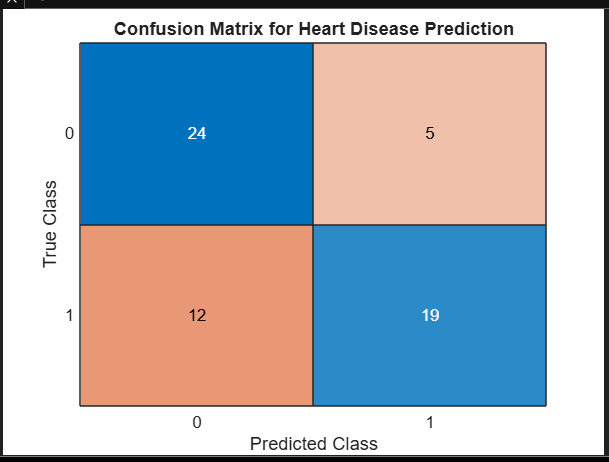

# 🫀 Heart Disease Predictor App (MATLAB App Designer)

This is a medium-complexity healthcare machine learning project built using **MATLAB App Designer**. The app predicts the presence or absence of heart disease using a **Decision Tree classifier** trained on the UCI Cleveland dataset. It features a professional GUI with 13 user inputs, dynamic prediction logic, and visual result feedback.

---

## 🔧 Technologies Used

- MATLAB App Designer  
- Statistics and Machine Learning Toolbox  
- Supervised Learning (Decision Trees)  
- GUI Development in MATLAB  

---

##  Project Goals

- Build a realistic heart disease prediction interface with medical relevance  
- Demonstrate an end-to-end machine learning workflow for healthcare  
- Strengthen my portfolio for **biomedical engineering** and **healthcare consulting**  
- Develop and deploy a professional-grade MATLAB GUI  

---

##  Model Performance

| Metric            | Value     |
|-------------------|-----------|
| Accuracy          | 75.4%     |
| True Positives    | 19        |
| True Negatives    | 24        |
| False Positives   | 5         |
| False Negatives   | 12        |

### Confusion Matrix:

---

##  App Interface Preview

> *(Add a screenshot here if available, e.g., `app_screenshot.png`)*

---
##  Sample Test Inputs

###  Low-Risk Patient
Sex: Female
Chest Pain: Non-anginal Pain
FBS: ≤ 120 mg/dL
ECG: Normal
Exang: No
Slope: Upsloping
CA: 0
Thal: Normal
Age: 45
BP: 120
Cholesterol: 180
Max HR: 170
ST Depression: 0.0

**Prediction:**  Not at Risk

###  High-Risk Patient
Sex: Male
Chest Pain: Asymptomatic
FBS: >120 mg/dL
ECG: ST-T Abnormality
Exang: Yes
Slope: Flat
CA: 2
Thal: Fixed Defect
Age: 65
BP: 150
Cholesterol: 260
Max HR: 110
ST Depression: 3.0

 Heart_Disease_Predictor.mlapp % Full App Designer source
 heart_disease_model.mat % Trained decision tree model
 confusion_matrix.png % Performance visualization
 README.md % This documentation file
